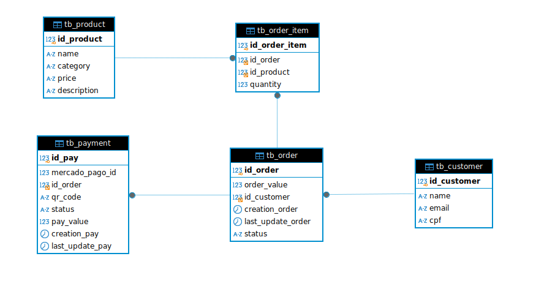

Modelagem de dados da aplicação: 

Banco escolhido: Amazon RDS (com o mecanismo Mysql)

Optamos pelo Amazon RDS com MySQL porque ele oferece uma solução gerenciada que garante alta disponibilidade, escalabilidade e segurança. Considerando as características da aplicação que estamos desenvolvendo, a escolha de um banco de dados relacional é a mais adequada, pois ele é ideal para lidar com dados estruturados, garantindo consistência e integridade.

Com o MySQL, temos a capacidade de executar consultas complexas e gerar relatórios e análises no futuro, conforme a necessidade da aplicação. Além disso, nossa equipe possui grande expertise em bancos relacionais, o que facilita o processo de desenvolvimento e manutenção no dia a dia.

Essa escolha nos proporciona o equilíbrio ideal entre performance, segurança e facilidade de gerenciamento, permitindo que o sistema cresça de forma sustentável sem comprometer a qualidade e a integridade dos dados.
